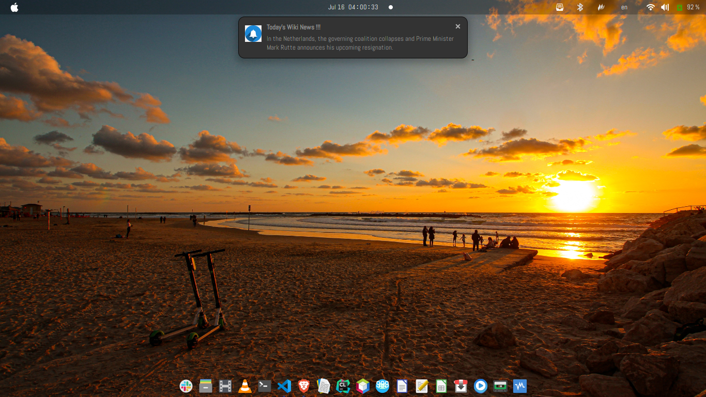

### What is this project about?

When you go to https://en.wikipedia.org/wiki/Main_Page, there is a section called "In the news" where you can read some of the latest and trending news about politics, sports, science, etc. This program fetches the exact news from Wikipedia and brings them to YOU! You don't have to open your browser; the news is directly served to you!

### What are the requirements?
- Platform: Linux
- Python2 or Python3 interpreter
- Install the notify2 package

### One cool thing (not the only one!) you can do with this program
- Add #![path/to/your/python/interpreter] at the beginning of the program wiki_main_page.py, e.g., #!/usr/bin/python3.
- Copy the program to /usr/bin.
- Make it executable by changing the file permissions
- Add the program to your startup programs.
- Receive the latest news from Wikipedia as soon as you log into your computer!

### Simple screenshot

    

### What is underway?
A similar implementation for Windows. Stay tuned!!